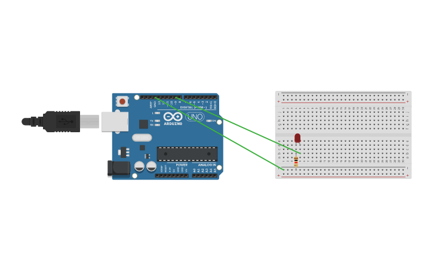

# Morse Code Decoder(using Binary Trees)

Made this decoder during an event in my university called HackNight5.0! Happened to get 6th place in this event and was super happy with the result.


I have uploaded all my methods of implementation of the decoder in this repo.

1. I began with a Linked List implementation since I found that to be the easiest for me.
2. I then switched to an array implementation since the Linked List method involved using ```malloc``` which could not be used in an Arduino.
3. I then made the code to run on Arduino!

The arduino model for this in [here](https://www.tinkercad.com/things/6K99E8GOJGd)!

